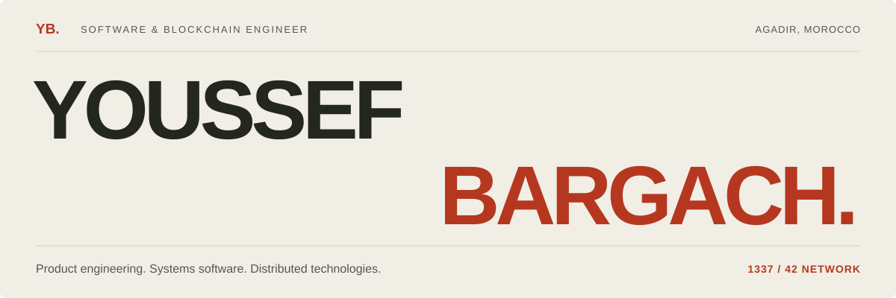

  <a href="https://portfolio-topaz-three-za1h48mx5k.vercel.app/"><b>PORTFOLIO ↗</b></a>
  &nbsp;&nbsp; / &nbsp;&nbsp;
  <a href="https://www.linkedin.com/in/youssefbargach/"><b>LINKEDIN ↗</b></a>
  &nbsp;&nbsp; / &nbsp;&nbsp;
  <a href="https://portfolio-topaz-three-za1h48mx5k.vercel.app/cv"><b>VIEW CV ↗</b></a>

## 01 / About

I'm **Youssef Bargach**, a **Software & Blockchain Engineer** based in Agadir, Morocco.

I build product interfaces, data workflows, systems software, and infrastructure. My work spans full-stack applications, low-level programming, and distributed technologies, with a blockchain focus on smart contracts, application integration, and permissioned networks.

My **1337 Coding School / 42 Network** projects explore systems programming, networking, infrastructure, and graphics through a project-based, peer-learning curriculum.

## 02 / Selected work

<table>
<tr>
<td width="50%" valign="top">
<h3>SihaRx</h3>

PRODUCT ENGINEERING · PHARMACY PLATFORM

A multi-tenant platform connecting pharmacy inventory, sales, orders, reception, payments, and customer balances.

I work across the product interface, server-side validation, database operations, and regression tests, with a focus on tenant boundaries and data integrity.

<code>Next.js</code> <code>React</code> <code>TypeScript</code> <code>PostgreSQL</code>

<a href="https://portfolio-topaz-three-za1h48mx5k.vercel.app/work/siharx/"><b>Explore the project ↗</b></a>

</td>
<td width="50%" valign="top">
<h3>Festival</h3>

SMART CONTRACTS · INDEPENDENT PROJECT

A set of Solidity contracts covering festival ticketing, scheduling, artist management, refunds, payments, and owner-controlled operations.

Separate contracts handle ticket counts, access control, time-dependent pricing, artist payments, and settlement rules.

<code>Solidity</code> <code>Access control</code> <code>Settlement</code>

<a href="https://github.com/ybargach/Contracts/tree/main/Festival"><b>Explore the contracts ↗</b></a>

</td>
</tr>
</table>

### Built at 1337 / 42

| Project | Engineering focus | Stack |
| :--- | :--- | :--- |
| **ft_transcendence** · Team project | Real-time multiplayer Pong. My contribution: a smart contract recording tournament results on Ethereum, integrated with the backend through Web3. | Solidity · JavaScript · Python · Web3 |
| **Inception** | Isolated services assembled into a working application environment. | Docker · Docker Compose · NGINX · WordPress |
| **Minishell** | A Unix shell exploring processes and command execution. | C · POSIX · GNU Readline · Makefile |
| **ft_irc** | An IRC server handling connected clients and network events. | C++ · Sockets · epoll |
| **Cub3D** | A first-person raycasting renderer built from a 2D map. | C · MiniLibX · Raycasting |

[More about these projects ↗](https://portfolio-topaz-three-za1h48mx5k.vercel.app/#school-projects)

## 03 / Toolkit

| Area | Technologies |
| :--- | :--- |
| **Languages** | C · C++ · Go · Python · JavaScript · TypeScript |
| **Blockchain** | Solidity · Hyperledger Fabric |
| **Frontend** | Next.js · React · Tailwind CSS |
| **Data / Backend** | PostgreSQL |
| **Infrastructure** | Git · Docker · Docker Compose · NGINX · Linux |

## 04 / Let's build something

Software, systems, blockchain, or something worth building.

**[Connect on LinkedIn ↗](https://www.linkedin.com/in/youssefbargach/)** &nbsp; · &nbsp; **[Visit my portfolio ↗](https://portfolio-topaz-three-za1h48mx5k.vercel.app/)**

---

Agadir, Morocco &nbsp; / &nbsp; 1337 · 42 Network &nbsp; / &nbsp; <b>@ybargach</b>

