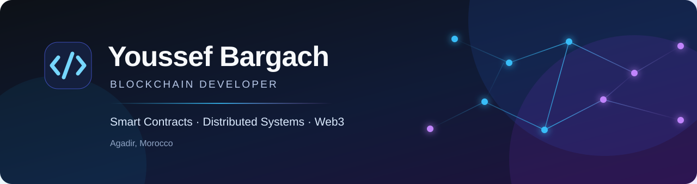

  

  <a href="https://bargach.dev">Portfolio</a> · <a href="https://linkedin.com/in/youssefbargach/">LinkedIn</a> · Agadir, Morocco

## Building systems you can verify

I am a blockchain developer focused on secure, practical software for distributed environments. I work across private blockchain networks, Solidity smart contracts, and dApp architecture—from the protocol layer to the developer experience.

## Focus

| Area | What I build |
| :-- | :-- |
| **Private networks** | Hyperledger Fabric, distributed ledgers, and network architecture |
| **Smart contracts** | Solidity contracts, testing, and security-minded design |
| **Web3 products** | dApp integrations, backend services, and developer workflows |
| **Systems foundations** | Reliable tooling and performance-conscious software in C/C++ |

## Toolbox

  <code>Solidity</code>
  <code>Hyperledger Fabric</code>
  <code>Ethereum</code>
  <code>TypeScript</code>
  <code>JavaScript</code>
  <code>Python</code>
  <code>Go</code>
  <code>C</code>
  <code>Docker</code>
  <code>Git</code>

## Principles

> **Trust no one. Verify everything. Build on-chain.**

Secure by design · Verifiable by default · Practical in production

## Connect

For collaboration around blockchain infrastructure, smart contracts, or developer tools, find me at [Bargach.dev](https://bargach.dev) or on [LinkedIn](https://linkedin.com/in/youssefbargach/).
